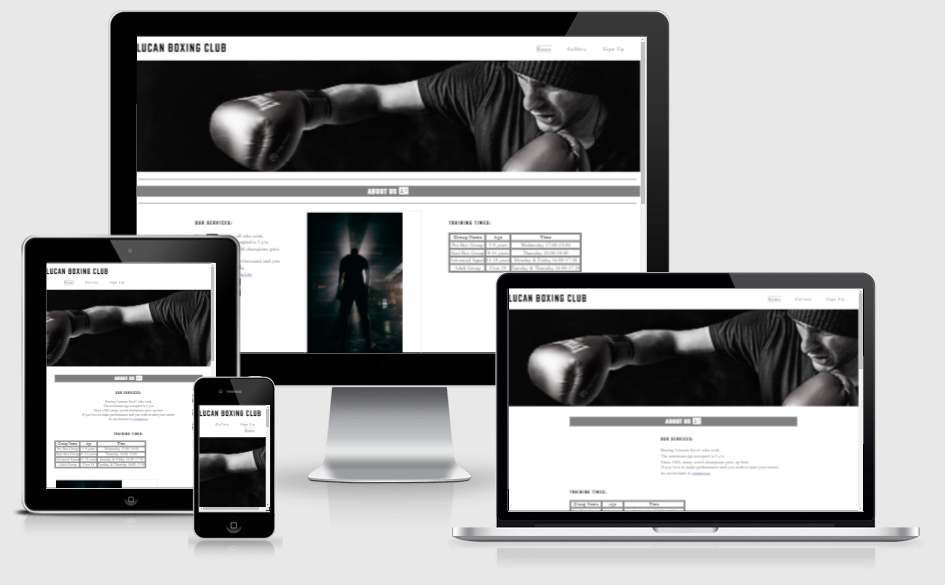

# **Lucan Boxing Club**
**[View the live project here!](https://sbnn3.github.io/lucan-boxing-club)** 

This is the Lucan Boxing Club official website. 
The website design will allow you to access all sections easy and to enjoy every minute spending on our virtual "ring".

# **User Experience (UX)**
<ul>
<li><h3>User Stories</h3></li>
<ul>
<li><strong>First Time Visitor Goals</strong></li>
<ol type="a">
<li>As a first time visitor, i would like to easily understand the website's main propose and learn more about the club.</li>
<li>As a first time visitor, i want to be able to easy navigate throughout the website.</li>
<li>As a first time visitor, i would like to find information and details that i'm looking for.</li>
</ol>
</ul>
<ul>
<li><strong>Returning Visitor Goals</strong></li>
<ol type="a">
<li>As a returning visitor, i would like to find information about membership types and prices.</li>
<li>As a returning visitor, i want to find a online chat.</li>
<li>As a returning visitor, i want to find a trophees section details.</li>
</ol>
</ul>
<ul>
<li><strong>Frequent User Goals</strong></li>
<ol type="a">
<li>As a frequent user, i want to check if there any new photos from training or championships.</li>
<li>As a frequent user, i want to check if there any news relating upcoming championships.</li>
<li>As a frequent user, i want to Sign-Up and receive email notifications all the time when some major updates happen.</li>
</ol>
</ul>
</ul>

# **Testing User Stories from User Experience (UX) Section**

<ul>
<li><strong>First Time Visitor Goals</strong></li>
<ul>
<li>As a first time visitor, i would like to easily understand the website's main propose and learn more about the club.</li>
<ul>
<li>Upon entering the site, users are automatically greeted with a clean and easily readable navigation bar that will help to visit all our website pages and about us section, where you can learn more about the club.</li>
<li>The user has the option to sign-up online and visit the gallery page for images during tournaments and trainings.</li>
</ul></ul></ul>

# **Design**
<ul>
<li><strong>Colour Scheme</strong></li>
<ol type="a">
<li>The two main colours used are Gray & Black.</li>
</ol>
</ul>
<ul>
<li><strong>Typography</strong></li>
<ol type="a">
<li>The Source Serif 4 font is the main font used throughout the whole website with Teko as a second font. Both fonts was imported from Google fonts.</li> 
</ol>
</ul>
<ul>
<li><strong>Imagery</strong></li>
<ol type="a">
<li>Imagery is very important thing on the website. The logo image is designed to be take attention from website visitor. It also has modern and sport theme aesthetic.</li></ol>
</ul> 

# **Testing**
<ul>
<li>
The website works in different browsers: Chrome, Firefox, Safari. 
</li>
<li>
The website was viewed on a variety of devices such as Desktop, Laptop, iPhone 7, iPhone 8, iPhone X, iPhone 12.
</li>
<li>
I confirm that the website is fully operational and looks good. 
</li>
<li>
I confirm that all sections and pages are all readable and easy to understand.  
</li>
</ul>

# **Bugs**
### **Solved Bugs**
<ul>
<li>
I started to work on the website and had all sections to the main page, after that trying different new things decided to separate the sections in different pages. Here i mean Sign Up Page and Gallery Page. </li></ul>

# **Languages Used**
<ul>
<li><a href="https://en.wikipedia.org/wiki/HTML5">HTML5</a></li>
<li><a href="https://en.wikipedia.org/wiki/Cascading_Style_Sheets">CSS</a></li>
</ul>

# **Features**
<ul>
<li>Reponsive on all devices sizes.</li>
<li>Interactive elements</li>
</ul>

# **Frameworks, Libraries & Programs Used**
<ol type="1">
<li><a href="https://fonts.google.com/">Google Fonts</a></li>
<ul>
<li>Google Fonts was used to import both fonts into the style.css file which is used on all pages throughout the project.</li>
</ul>
<li><a href="https://fontawesome.com/">Font Awesome</a></li>
<ul>
<li>Font Awesome was used on all pages throughout the website to add icons for aesthetic and UX purposes.</li>
</ul>
<li><a href="https://github.com/">GitHub</a></li>
<ul>
<li>GitHub is used to store the projects code after being pushed from Git.</li>
</ul>
<li><a href="https://www.adobe.com/ie/products/photoshop.html">Photoshop</a></li>
<ul>
<li>Photoshop was used to create the logo, resizing images and editing photos for the website.</li>
</ul>
</ol>

# **Navigation**
<ul>
<li>
Situated on the top of the page, the navigation shows the boxing club name in the left corner.</li>
<li>
Other navigation links are on the top right side: Home, Gallery and Sign-Up which link to different pages on the project.</li>
<li>
The navigation bar is very easy to use without any hidden difficulties.</li></ul>

# **About Us**
<ul>
<li>
The About Us section contains details about club. Services provided and a training time table. </li>
<li>
The About Us section also contains a beautiful photo on the middle of section. </li></ul>

 

# **Gallery**
<ul>
<li>
Gallery page contains a different photos during training and championships of club members.</li></ul>

 

# **Sign-Up**
<ul>
<li> 
Sing-Up Page contains a very beautiful photo like background and a sign-up form situated on the middle of image.</li></ul>

# **Contact**
<ul>
<li>
The Contact section is situated at the bottom of every page on the website.</li>
<li>
The Contact section contains details about club address, contact details, google maps exactly location indicated and social media links.</li></ul>

# **Validator Testing**
<ul>
<li>
HTML - No errors were returned when passing through the official W3C Validator.</li>
<li>CSS - No errors were returned when passing through the official (Jigsaw) Validator.</li>
</ul>

### **Accesibility**

# **Deployment**
### **GitHub Pages**

The project was deployed to GitHub pages using the following steps...

<ol type="1">
<li>Log in to GitHub and locate the <a href="https://github.com/sbnn3?tab=repositories">GitHub Repository</a></li>
<li>At the top of the Repository (not top of page), locate the "Settings" Button on the menu.</li>
<li>Scroll down the Settings page until you locate the "GitHub Pages" Section.</li>
<li>Under "Source", click the dropdown called "None" and select "main".</li>
<li>The page will automatically refresh.</li>
<li>Scroll back down through the page to locate the now published site <a href="https://sbnn3.github.io/lucan-boxing-club/">link</a> in the "GitHub Pages" section.</li></ol>

# **Media**
<ul>
<li> 
All images from the website was taken from <a href="https://www.pexels.com/">Pexels</a></li></ul>

# **Content**
<ul>
<li>All content was written by Sebastian Neagu.</li>
</ul>

# **Acknowledgements**
<ul>
<li>My Mentor Gerard McBride for continuous helpful feedback.</li>
<li>Tutor support at Code Institute for their support.</li>
</ul>
