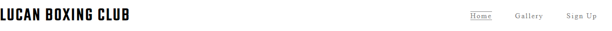

<h1>Lucan Boxing Club</h1>

<strong><a href="https://sbnn3.github.io/lucan-boxing-club">View the live project here!</a></strong> 

This is the Lucan Boxing Club official website. The website design will allow you to access all sections easy and to enjoy every minute spending on our virtual "ring". 

 

<h1>Testing</h1>
<ul>
<li>
The website works in different browsers: Chrome, Firefox, Safari. 
</li>
<li>
I confirm that the website is fully operational and looks good. 
</li>
<li>
I confirm that all sections and pages are all readable and easy to understand.  
</li>
</ul>

<h1>Bugs</h1>
<h3>Solved Bugs</h3>
<ul>
<li>
I started to work on the website and had all sections to the main page, after that trying different new things decided to separate the sections in different pages. Here i mean Sign Up Page and Gallery Page. </li></ul>

<h1>Navigation</h1>
<ul>
<li>
Situated on the top of the page, the navigation shows the boxing club name in the left corner.</li>
<li>
Other navigation links are on the top right side: Home, Gallery and Sign-Up which link to different pages on the project.</li>
<li>
The navigation bar is very easy to use without any hidden difficulties.</li></ul> 

<h1>About Us</h1>
<ul>
<li>
The About Us section contains details about club. Services provided and a training time table. </li>
<li>
The About Us section also contains a beautiful photo on the middle of section. </li></ul> 

<h1>Gallery</h1>
<ul>
<li>
Gallery page contains a different photos during training and championships of club members.</li></ul> 

<h1>Sign-Up</h1>
<ul>
<li> 
Sing-Up Page contains a very beautiful photo like background and a sign-up form situated on the middle of image.</li></ul> 

